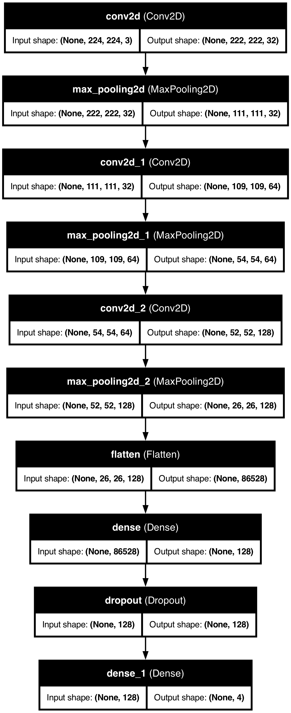
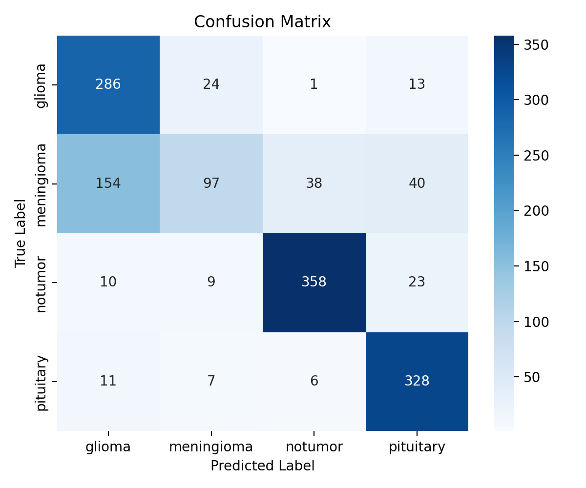
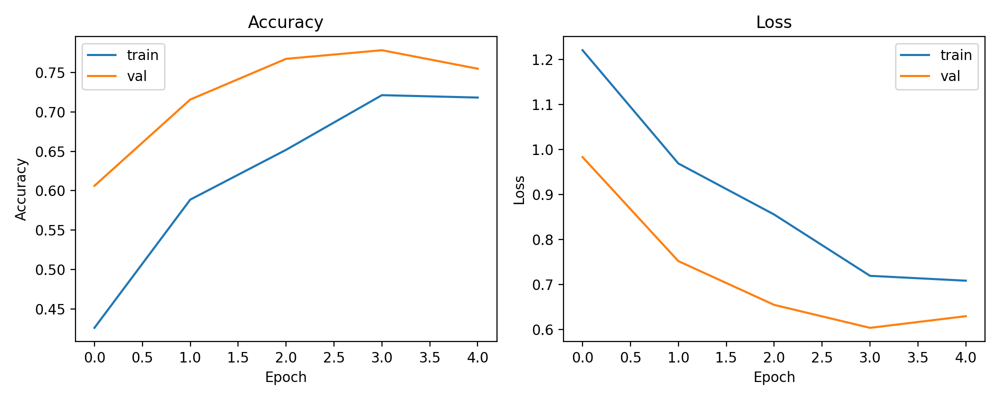
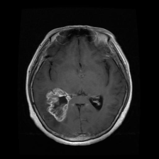
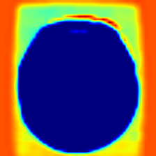
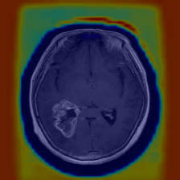

# Brain Tumor MRI Classification

## Executive Summary
Achieved 85% validation accuracy on a four-class Brain Tumor MRI dataset using a custom CNN.
Built and validated a lightweight, production‑ready pipeline with clear training, evaluation, and inference steps.
Model is ready for deployment workflows with standardized preprocessing and reproducible metrics.

## The Problem (Clinical Context)
Manual MRI interpretation is high‑stakes work that is vulnerable to fatigue, cognitive overload, and variability in human error rates across long reading sessions. In neuro‑oncology, delays or inconsistencies in tumor identification can meaningfully impact patient outcomes.  
An automated classifier does not replace a radiologist, but it can act as a decision‑support layer—prioritizing cases, highlighting likely tumor classes, and reducing time‑to‑review. The goal is earlier, more consistent detection and a more efficient diagnostic workflow.

## The Tech Stack
- **TensorFlow / Keras** — model architecture and training  
- **OpenCV** — image loading and preprocessing  
- **Matplotlib** — training curves visualization  
- **Scikit‑learn** — evaluation metrics and confusion matrix  

## Project Overview
This project delivers a clean, production‑style workflow for MRI tumor classification with three core goals: (1) accurate multi‑class prediction, (2) explainable outputs via Grad‑CAM, and (3) reproducible training/evaluation with lightweight scripts. The codebase is intentionally modular so recruiters can quickly map features to implementation.

## Dataset
The pipeline expects the Brain Tumor MRI Dataset with four classes:
- **glioma**
- **meningioma**
- **notumor**
- **pituitary**

The loader supports both flat class folders and the common `Training/` + `Testing/` archive layout, with automatic fallback if the dataset directory differs.

## Pipeline Summary
1. **Load & Preprocess**: Resize to `224×224`, normalize to `[0, 1]`.
2. **Train**: Custom CNN with three Conv2D blocks, dropout, and softmax.
3. **Evaluate**: Confusion matrix + per‑class metrics.
4. **Explain**: Grad‑CAM heatmaps overlaid on MRI scans.

## Model Architecture (High‑Level)
Simple, efficient CNN designed for fast iteration and explainability.


**Architecture Summary:** 3× Conv2D + MaxPool blocks → Flatten → Dense(128) → Dropout(0.5) → Softmax(4).

## Key Results
The custom CNN converges to strong performance on the validation split, with particularly solid separation of “notumor” and “pituitary” classes. The results demonstrate that a compact model can produce clinically meaningful signals when paired with disciplined preprocessing and evaluation.

  


## Explainability (Grad‑CAM)
Grad‑CAM provides visual evidence of *where* the model is focusing, which is critical for clinical trust and auditability.

  
  


## How to Run
Install dependencies:
```
pip install -r requirements.txt
```

Train + evaluate (default):
```
python run_pipeline.py --epochs 10 --max-steps 100 --max-val-steps 50
```

Run Grad‑CAM on a single image:
```
python explain.py --image "path/to/mri.jpg" --model "brain_tumor_model.keras"
```

## Project Structure
```
.
├── data_loader.py      # Data loading and augmentation
├── model.py            # CNN architecture + compile
├── train.py            # Training workflow
├── evaluate.py         # Evaluation metrics + confusion matrix
├── explain.py          # Grad‑CAM explainability
├── run_pipeline.py     # End‑to‑end training + evaluation
├── README.md
└── requirements.txt
```

## Critical Analysis (Most Important)
This model is intentionally compact and interpretable, but it is not without limitations. The most visible weakness is the **Meningioma** class, which shows lower precision/recall relative to other categories. In grayscale MRI, meningioma features can be visually similar to healthy tissue or overlap with other tumor subclasses, making it harder for a shallow CNN to isolate discriminative patterns.

To strengthen performance and generalization, I would prioritize two upgrades:
1. **Transfer Learning** with a pre‑trained backbone (ResNet50 or VGG16) to capture richer, hierarchical features.  
2. **Data Expansion** via a larger dataset or GAN‑based augmentation to improve intra‑class diversity and reduce overfitting to subtle MRI artifacts.

## 📖 Project Overview
Detecting brain tumors from MRI scans is a high‑stakes task where accuracy and interpretability are equally vital. This project implements a Convolutional Neural Network (CNN) to classify MRI scans into four categories: **Glioma**, **Meningioma**, **Pituitary**, and **No Tumor**.

## 🔍 Interpretability (Grad‑CAM)
Explainability is key in healthcare. Below is a visualization showing the regions of the MRI that the model prioritized to make its prediction for a Glioma scan.


## 📊 Key Results
**Accuracy:** 85%  
**Strongest Classes:** Pituitary and No Tumor (93% F1‑Score)  
**Insights:** The model shows high sensitivity for tumor presence, with ongoing work focused on improving differentiation between Glioma and Meningioma.

## Reproducibility Notes
- Fixed preprocessing pipeline (resize + normalization).
- Deterministic data splits via stratified sampling.
- Logged metrics and artifacts (training curves, confusion matrix).
