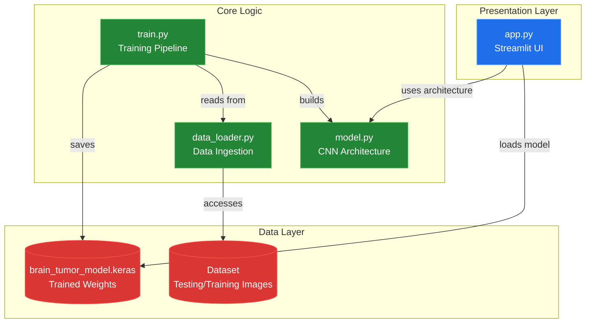
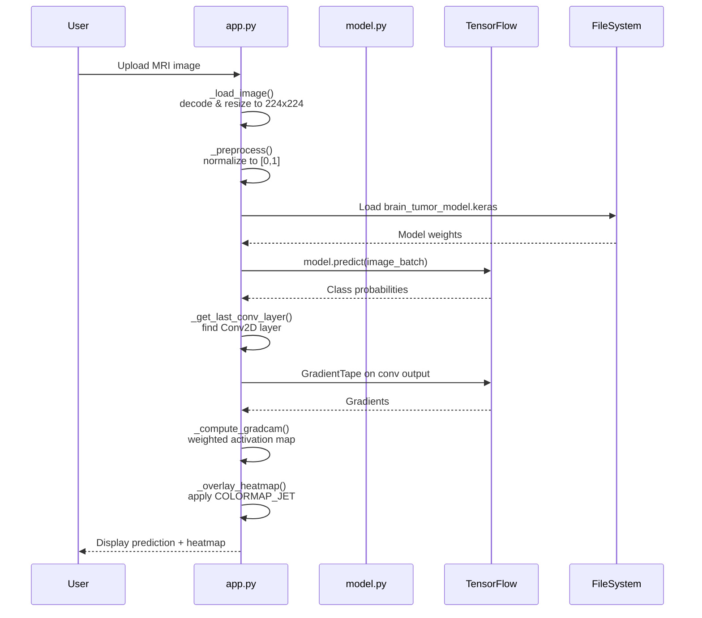

# System Blueprint: suryayalavarthi/brain-tumor-detection-cnn

> Deep learning pipeline for 4-class Brain Tumor classification with Grad-CAM explainability.
>
> Auto-generated on 2026-02-16 by Repo-to-Blueprint Architect

## Project Purpose
This project classifies brain MRI scans into four categories (glioma, meningioma, no tumor, pituitary) using a custom CNN and provides visual explanations via Grad-CAM heatmaps through a Streamlit web interface.

## Technical Stack
- **Language**: Python
- **Framework**: TensorFlow 2.20.0, Streamlit 1.37.0
- **Key Dependencies**: opencv-python-headless 4.13.0.90, numpy 2.4.1, scikit-learn 1.8.0, matplotlib 3.10.8, seaborn 0.13.2

## Architecture Blueprint

## Request Flow

## Evidence-Based Risks

1. **Hardcoded Model URL in app.py**: Line 14 references GitHub release URL for model download, creating external dependency that breaks if release is moved/deleted (app.py:14-17).

2. **Missing data_loader.py Implementation**: train.py imports `load_data` from data_loader module (train.py:11) but data_loader.py is absent from file tree, causing ImportError at runtime.

3. **No Model Persistence Validation**: app.py attempts to load `brain_tumor_model.keras` (app.py:13) without existence check; train.py saves as `.h5` format (train.py:68) creating format mismatch between training and inference.

---

## Repository Stats
| Metric | Value |
|--------|-------|
| Total Files | 7047 |
| Total Directories | 14 |
| Generated | 2026-02-16 |
| Source | [suryayalavarthi/brain-tumor-detection-cnn](https://github.com/suryayalavarthi/brain-tumor-detection-cnn) |

---

*Generated by Repo-to-Blueprint Architect via n8n*
